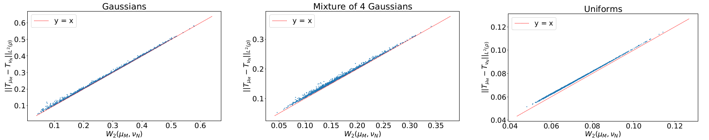

# Quantitative Stability of Optimal Transport Maps and Linearization of the 2-Wasserstein Space

Experiments for the paper [*Quantitative Stability of Optimal Transport Maps and Linearization of the 2-Wasserstein Space*](https://arxiv.org/abs/1910.05954), [Q. Mérigot](http://quentin.mrgt.fr/), A. Delalande, [F.Chazal](https://geometrica.saclay.inria.fr/team/Fred.Chazal/), to appear in AISTATS 2020.

## Dependencies
The dependencies to run these experiments are listed in `requirements.txt`. In particular, [pysdot](https://pypi.org/project/pysdot/) was used to compute the (semi-discrete) Monge maps. This package can be installed using:
```
    $ pip install pysdot
```

## Notebooks

### [`distance_approximation.ipynb`](https://github.com/AlxDel/stability_ot_maps_and_linearization_wassertein_space/blob/master/distance_approximation.ipynb)
Comparison of the 2-Wasserstein distance and the distance between Monge embeddings.



### `sampling_approximation.ipynb`
Observing the accuracy of the estimation of Monge maps from finite samples in function of the sample size.

TODO

###  [`barycenter_interpolation.ipynb`](https://github.com/AlxDel/stability_ot_maps_and_linearization_wassertein_space/blob/master/barycenter_interpolation.ipynb)
Point cloud interpolation using the approximate Wasserstein barycenter deduced from Monge embeddings.


### [`mnist_clustering.ipynb`](https://github.com/AlxDel/stability_ot_maps_and_linearization_wassertein_space/blob/master/mnist_clustering.ipynb)
Clustering the MNIST training set with KMeans on Monge embeddings.


## Citing this work

Original publication:
```
@misc{mrigot2019quantitative,
    title={Quantitative stability of optimal transport maps and linearization of the 2-Wasserstein space},
    author={Quentin Mérigot and Alex Delalande and Frédéric Chazal},
    year={2019},
    eprint={1910.05954},
    archivePrefix={arXiv},
    primaryClass={stat.ML}
}
```